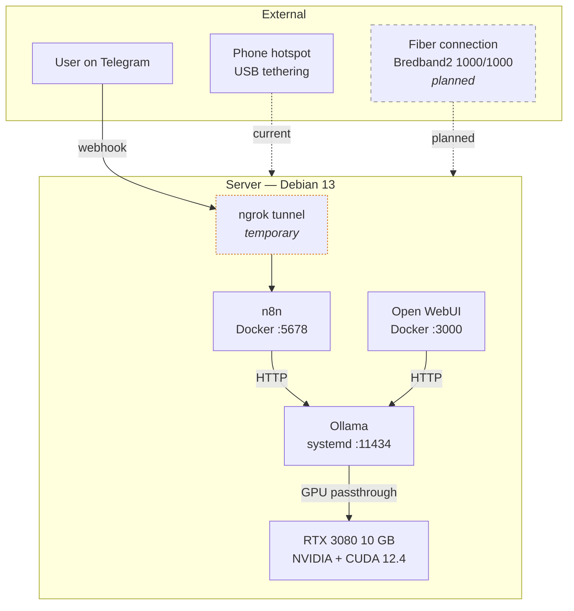
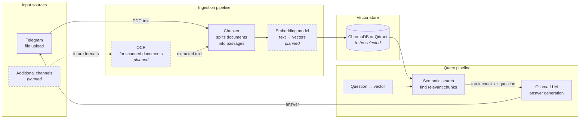
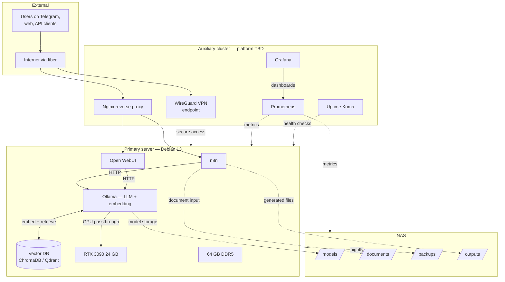

# Architecture

*Three views of the system: how it runs today, the document-intelligence pipeline being built, and the Phase 4 endgame.*

---

## 1. Current state (April 2026)

The server is physically installed on an open-bench configuration with a single user-facing role: serve local inference to downstream applications over the local network and through a temporary public tunnel. All AI processing happens on the host itself — no external AI provider is involved at any point.

**Notes on the current state:**

- The internet connection is currently USB tethering from a phone. A Bredband2 1000/1000 fiber subscription has been identified as the intended replacement. Until the fiber connection is installed, the server's public IP changes per session and the static-IP configuration is blocked.
- The ngrok tunnel is a temporary HTTPS entry point for inbound webhooks from Telegram. Its URL resets on every restart of the tunnel, which means the Telegram bot's webhook must be reconfigured each time. This is the single largest source of fragility in the current deployment and is next on the list to replace.
- Ollama runs as a native systemd service rather than in a container, bound to `0.0.0.0:11434` so the n8n and Open WebUI containers can reach it over the host network. This is a deliberate choice: GPU passthrough is simpler when the inference engine is on the host, and model files stored on the host SSD do not need to be mapped into a container.
- Open WebUI and n8n are each in their own Docker container. Both expose a web interface on a dedicated port and are only accessible from the local network today.

---

## 2. Document intelligence pipeline (under construction)

A document Q&A system is being built alongside the core inference stack. Rather than feeding entire documents into a language model's context window — an approach that does not scale past a few pages — the pipeline uses retrieval-augmented generation (RAG). Documents are chunked, converted into numerical embeddings, and stored in a vector database. At query time, only the most relevant chunks are retrieved and passed to the language model along with the user's question.

**Status of each component:**

- **Telegram input:** working today for plain PDFs (workflow is currently being debugged at the text-extraction step).
- **OCR:** planned but not yet integrated. Needed for scanned documents and image-based PDFs.
- **Chunker:** straightforward text processing in n8n or Python. Not yet built.
- **Embedding model:** will run locally on the same GPU as the main language model. Likely candidates are `nomic-embed-text`, `bge-m3` (multilingual — Arabic/French/English), or a quantised multilingual sentence-transformer model. Final choice depends on testing.
- **Vector store:** ChromaDB is the leading candidate — simple, Docker-friendly, single-node-appropriate. Qdrant is a more production-grade alternative and will be evaluated if ChromaDB hits performance or feature limits.
- **Retrieval logic:** semantic search over the vector store, returning the top-k most relevant chunks for each question.
- **LLM for generation:** the existing Ollama stack. For multilingual questions, Qwen2.5 7B is the natural default.

**Why this design matters for the target use cases:**

The intended applications — technical-specification review, test-report summarisation, bilingual document triage — all involve documents that are too long to fit in any model's context window. Retrieval-augmented generation is the standard way to solve this, and building it locally keeps the entire pipeline on owned hardware. A client's confidential documents never leave the network during ingestion or querying.

---

## 3. Phase 4 endgame

Phase 4 adds shared infrastructure — storage, monitoring, secure remote access — and upgrades the inference capacity of the primary server. It does not add a second compute server; that is a separate, conditional future build.

**What changes between today and Phase 4:**

| Layer | Current | Phase 4 |
|---|---|---|
| Internet | Phone hotspot (USB) | Fiber 1000/1000 |
| Public entry | ngrok (temporary) | Nginx reverse proxy on the cluster |
| Remote access | SSH over LAN only | WireGuard VPN from anywhere |
| Inference GPU | RTX 3080 10 GB | RTX 3090 24 GB |
| System RAM | 32 GB | 64 GB |
| PSU | 750 W | 850 W (upgrade required for 3090) |
| Storage | Local NVMe only | Local NVMe + NAS (RAID) |
| Monitoring | `nvidia-smi` by hand | Prometheus + Grafana + Uptime Kuma |
| Enclosure | Open-bench | Corsair 4000D |
| RAG pipeline | Under construction | Fully integrated with vector store |
| Model ceiling | 9 B (comfortable) / 13 B (tight) | 30 B (comfortable) |

**Design principles for Phase 4:**

- **Compute and infrastructure are separated.** The primary server does the work that needs a GPU — inference, embedding generation, retrieval. The auxiliary cluster does the everything-else work: proxy, VPN, monitoring. This means a failure in the monitoring stack cannot take down inference, and a reboot of the primary server does not break public access to other services.
- **The NAS is shared storage, not a backup.** Models, ingested documents, vector-database snapshots, and generated outputs live on the NAS so that the primary server becomes stateless in principle — if the primary server dies, a replacement can re-mount the NAS and resume. Backups are a separate concern handled by nightly snapshots to a different volume on the NAS.
- **Nothing new is consumer-cloud dependent.** The public entry point is a self-hosted Nginx instance behind the fiber connection, not a third-party tunnel service. The VPN is WireGuard, self-hosted. The monitoring stack is self-hosted. The vector database is self-hosted. This is consistent with the core value proposition of the project: private AI, on owned infrastructure, with no cloud dependency for the inference or retrieval paths.
- **The auxiliary cluster platform is deliberately unspecified.** It could be Raspberry Pi 5, Orange Pi 5 Plus, a Jetson Orin Nano, a mini PC (Intel N100 / N150), or a small used office PC. The decision is deferred until closer to purchase because 2026 small-compute pricing is volatile. The roles are fixed; the hardware is not.

---

## Additional capabilities planned for the same stack

The architecture above focuses on the primary value proposition — local LLM plus RAG for document intelligence — but the same hardware will also host several peripheral capabilities. These share the GPU, the NAS, and the same gateway infrastructure:

- **Faster Whisper** for local speech-to-text transcription in Arabic, French, and English. Useful for meeting transcription, voice-note ingestion into the document pipeline, and any future voice-controlled workflows.
- **ComfyUI** for local image generation. Lower priority than the LLM and RAG stack but included in the software roadmap as a capability the hardware can support when the main pipelines are stable.
- **OCR** (using tools such as Tesseract or newer open-source models) as part of the document ingestion pipeline, specifically for scanned PDFs and image-based documents. Shown in the document intelligence diagram above.

These are intentionally kept off the main diagrams to avoid cluttering the core story. They run on the same GPU as the LLM and embedding model, time-sharing rather than competing for resources because none of them run continuously.

---

## What is deliberately not in Phase 4

The diagrams above stop at the boundary of what Server 1 (this build) can reasonably support. Everything beyond this point belongs to a separate, future, conditional build (Server 2) and is not documented here. In particular:

- **70 B class models** are outside the capacity of a 24 GB GPU and require either multi-GPU setups or different hardware entirely.
- **Dual-GPU configurations** are not possible on this motherboard at full bandwidth — the B650E MAX has only one PCIe x16 slot wired at full width.
- **Fine-tuning workloads** are not in scope for Server 1.
- **Concurrent multi-user inference at scale** — the current design assumes a small number of users (self, close collaborators, pilot clients), not a public SaaS load.

These belong to Server 2 planning, which is gated on business profitability rather than infrastructure readiness.

---

*Last updated: 24 April 2026*
